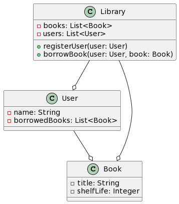

# OpenAI Examples
A collection of [OpenAI](https://openai.com/) examples using the Python API and the model on the web.

## Quickstart
### Required Packages
* [aocd](https://github.com/wimglenn/advent-of-code-data)
    * `pip install aocd`
* [openai](https://github.com/openai/openai-python)
    * `pip install openai`
### Environment Variables
* AOC_SESSION - Session ID taken from browser cookie information
* OPENAI_API_KEY - Create an API key in your OpenAI account and enter it's value in this variable

## Examples
### Advent of Code
Based on @ostwilkens AoC solution https://github.com/ostwilkens/aoc2022.

Generated solutions for Advent of Code 2022:
* [day1/part1](aoc/2022-1-1.py)
* [day1/part2](aoc/2022-1-2.py)
* [day3/part1](aoc/2022-3-1.py)
* [day3/part2](aoc/2022-3-2.py)
* [day4/part1](aoc/2022-4-1.py)
* [day4/part2](aoc/2022-4-2.py)

### Cyberdojo
In this example an algorithmic problem description taken from [cyber-dojo.org](https://cyber-dojo.org) is passed to the OpenAI model text-davinci-003. 
The following files have to be created per algorithmic problem:
* `<problem name>_desc.txt` - problem description
* `<problem name>_func.txt` - function prototype
* `<problem name>_input_<ident>.txt` - input data for testing

Generated solutions:
* Print Diamond [print_diamond.py](cyberdojo/print_diamond.py) [print_diamond_desc.txt](cyberdojo/print_diamond_desc.txt)
* Anagrams [anagrams.py](cyberdojo/anagrams.py) [anagrams_desc.txt](cyberdojo/anagrams_desc.txt)

### UML Diagram
#### Description
The following description is passed to the model [text-davinci-003](https://beta.openai.com/playground?model=text-davinci-003)
```
Draw an UML model in PlantUML syntax for the following use case. 
A library offers a lot of books. Books can be borrowed by users. 
Borrowed books are assigned to an user. 
A book has a shelf life.
```
#### Solution
[Snow Fall HTML Page](uml/BookLibrary.puml)


### HTML Page
#### Description
The following description is passed to the model [text-davinci-003](https://beta.openai.com/playground?model=text-davinci-003)
```
Snow fall on a html page

1. Create a html page with a black background color

2. Create a canvas in a html document which acts as background

3. Generate an animation of snow fall
```
#### Solution
[Snow Fall HTML Page](html/SnowFall.html "Snow Fall HTML Page")

## Special thanks to
* The OpenAI team
* Eric Wastl for creating https://adventofcode.com/
* wimglenn and contributors of https://github.com/wimglenn/advent-of-code-data
* ostwilkens sharing his OpenAI AoC solution https://github.com/ostwilkens/aoc2022 
